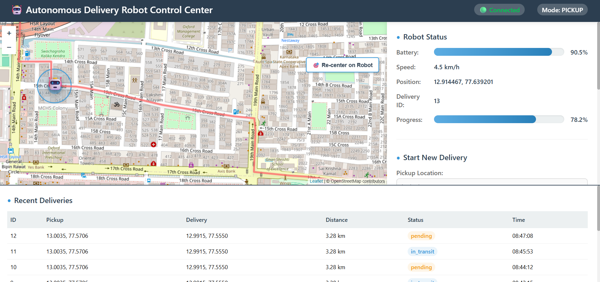

<div align="center">

# 🚗 OpenRoad-Autonomy 🤖

### *Autonomous Delivery Robot System with Real-Time Intelligence*

[](https://www.python.org/)
[](https://fastapi.tiangolo.com/)
[](LICENSE)
[](https://github.com/Tejascodz/OpenRoad-Autonomy/stargazers)

**Production-ready autonomous navigation • Real-time mapping • Intelligent path planning**

[🚀 Quick Start](#-quick-start) • [✨ Features](#-features) • [📖 Documentation](#-api-reference) • [🤝 Contributing](#-contributing)

---



*Watch your autonomous robot navigate city streets in real-time with WebSocket-powered live tracking*

</div>

---

## ✨ Why OpenRoad-Autonomy?

<table>
<tr>
<td width="50%">

### 🌍 **Intelligent Mapping**
```
✓ Real OpenStreetMap integration
✓ 26,211+ road network nodes
✓ Google Maps API fallback
✓ Dynamic grid generation
```

### 🤖 **Advanced Simulation**
```
✓ Realistic battery physics
✓ Obstacle detection AI
✓ GPS noise modeling
✓ State machine control
```

</td>
<td width="50%">

### 🗺️ **Smart Routing**
```
✓ A* pathfinding algorithm
✓ Dijkstra optimization
✓ Road-type weighting
✓ Real-time recalculation
```

### 📊 **Live Dashboard**
```
✓ WebSocket real-time updates
✓ Interactive Leaflet maps
✓ Delivery history tracking
✓ Emergency controls
```

</td>
</tr>
</table>

<div align="center">

### 🎯 Production-Ready Features

| Feature | Technology | Status |
|:--------|:-----------|:------:|
| **Path Planning** | A* & Dijkstra Algorithms | ✅ |
| **Real-Time Tracking** | WebSocket Protocol | ✅ |
| **Battery Management** | Physics-Based Model | ✅ |
| **Data Persistence** | SQLite Database | ✅ |
| **Hardware Ready** | GPIO/LIDAR/GPS Support | ✅ |
| **Cloud Deploy** | Docker + AWS/ECS | ✅ |

</div>

---

## 🏗️ System Architecture

<div align="center">

```ascii
╔═══════════════════════════════════════════════════════════════════╗
║                    🚗 OpenRoad-Autonomy System 🤖                 ║
╠═══════════════════════════════════════════════════════════════════╣
║                                                                   ║
║    ┏━━━━━━━━━━━━━┓         ┏━━━━━━━━━━━━━┓       ┏━━━━━━━━━━━━━┓  ║
║    ┃  Frontend   ┃ ══════▶ ┃   FastAPI   ┃ ════▶ ┃   Robot     ┃  ║
║    ┃  Dashboard  ┃ ◀══════ ┃   Server    ┃ ◀════ ┃ Controller  ┃  ║
║    ┃  (HTML/JS)  ┃         ┃  (Python)   ┃       ┃  (Asyncio)  ┃  ║
║    ┗━━━━━━━━━━━━━┛         ┗━━━━━━━━━━━━━┛       ┗━━━━━━━━━━━━━┛  ║
║         ║                        ║                      ║         ║
║         ║                        ║                      ║         ║
║         ▼                        ▼                      ▼         ║
║    ┏━━━━━━━━━━━━━┓         ┏━━━━━━━━━━━━━┓       ┏━━━━━━━━━━━━━┓  ║
║    ┃   Leaflet   ┃         ┃  WebSocket  ┃       ┃   SQLite    ┃  ║
║    ┃   Map UI    ┃         ┃  Real-Time  ┃       ┃  Database   ┃  ║
║    ┃             ┃         ┃  Updates    ┃       ┃             ┃  ║
║    ┗━━━━━━━━━━━━━┛         ┗━━━━━━━━━━━━━┛       ┗━━━━━━━━━━━━━┛  ║
║                                                                   ║
║  ┌─────────────────────────────────────────────────────────────┐ ║
║  │  🗺️  OSM Maps  │  🧭 A*/Dijkstra  │  🔋 Battery  │  🚨 Safety │ ║
║  └─────────────────────────────────────────────────────────────┘ ║
╚═══════════════════════════════════════════════════════════════════╝
```

**Data Flow:** User Input → API Processing → Path Planning → Robot Simulation → Live Updates → Dashboard

</div>

---

## 📁 Project Structure

```
OpenRoad-Autonomy/
├── 📂 app/
│   ├── 📄 __init__.py
│   ├── 📄 main.py                  # FastAPI application entry point
│   ├── 📄 config.py                # Configuration management
│   ├── 📂 models/                  # Database models
│   │   ├── 📄 delivery.py          # Delivery schema
│   │   └── 📄 robot_state.py       # Robot state machine
│   ├── 📂 services/                # Core services
│   │   ├── 📄 map_service.py       # OSM/Google Maps integration
│   │   ├── 📄 routing_engine.py    # A*/Dijkstra algorithms
│   │   ├── 📄 robot_controller.py  # Robot control logic
│   │   ├── 📄 battery_model.py     # Battery simulation
│   │   └── 📄 database_service.py  # SQLite operations
│   ├── 📂 api/                     # API endpoints
│   │   ├── 📄 routes.py            # REST endpoints
│   │   └── 📄 websocket_manager.py # WebSocket handling
│   └── 📂 static/                  # Frontend files
│       ├── 📄 index.html           # Dashboard
│       ├── 📂 css/
│       │   └── 📄 style.css        # Styling
│       └── 📂 js/
│           └── 📄 dashboard.js     # Frontend logic
├── 📂 tests/                       # Unit tests
├── 📂 logs/                        # Application logs
├── 📂 data/                        # SQLite database
├── 📄 requirements.txt             # Python dependencies
├── 📄 .env.example                 # Environment variables
├── 📄 .gitignore                   # Git ignore rules
├── 📄 Dockerfile                   # Docker configuration
├── 📄 docker-compose.yml           # Docker compose
└── 📄 README.md                    # This file
```

---

## 🚀 Quick Start

<div align="center">

### ⚡ Get Running in 5 Minutes

</div>

<table>
<tr>
<td width="33%" align="center">

### 📋 Prerequisites
```
Python 3.11+
pip
Git
```

</td>
<td width="33%" align="center">

### ⏱️ Setup Time
```
~5 minutes
```

</td>
<td width="33%" align="center">

### 💾 Disk Space
```
~150 MB
```

</td>
</tr>
</table>

### 📦 Installation Steps

```bash
# 1️⃣ Clone the repository
git clone https://github.com/Tejascodz/OpenRoad-Autonomy.git
cd OpenRoad-Autonomy

# 2️⃣ Create virtual environment
python -m venv venv

# Windows:
venv\Scripts\activate
# Mac/Linux:
source venv/bin/activate

# 3️⃣ Install dependencies
pip install -r requirements.txt

# 4️⃣ Configure environment
cp .env.example .env
# Edit .env with your configuration (optional)

# 5️⃣ Initialize database
python -c "from app.services.database_service import DatabaseService; DatabaseService()"

# 6️⃣ Launch the application 🎉
uvicorn app.main:app --reload --host 0.0.0.0 --port 8000
```

---

## 🎮 Usage Guide

<div align="center">

### 📍 Sample Coordinates (Bangalore, India)

| 📌 Location | 🌐 Latitude | 🌐 Longitude | 🎯 Use Case |
|:------------|:------------|:-------------|:------------|
| **Malleswaram** | 12.974178 | 77.545538 | Pickup Point |
| **Rajajinagar** | 12.9082 | 77.5217 | Delivery Point |
| **Majestic** | 12.9763 | 77.5712 | Transit Hub |
| **Indiranagar** | 12.9719 | 77.6412 | Alternative Route |

</div>

### 🚦 Step-by-Step Operation

<table>
<tr>
<td width="20%" align="center">

**1️⃣**<br>
🌐 Open<br>Dashboard

</td>
<td width="20%" align="center">

**2️⃣**<br>
📍 Enter<br>Coordinates

</td>
<td width="20%" align="center">

**3️⃣**<br>
🧭 Select<br>Algorithm

</td>
<td width="20%" align="center">

**4️⃣**<br>
🚀 Start<br>Delivery

</td>
<td width="20%" align="center">

**5️⃣**<br>
👁️ Watch<br>Live!

</td>
</tr>
</table>

<div align="center">


*Compare A* and Dijkstra algorithms on real road networks with live visualization*

</div>

---

## 📡 API Reference

<div align="center">

### 🔌 RESTful Endpoints

</div>

| Method | Endpoint | Description | Response |
|:------:|:---------|:------------|:---------|
| 🟢 **POST** | `/api/v1/start_delivery` | Start a new delivery mission | Delivery ID + Path |
| 🔵 **GET** | `/api/v1/robot_status` | Get current robot status | Battery, Position, State |
| 🔴 **POST** | `/api/v1/robot/emergency_stop` | Emergency stop robot | Immediate halt |
| 🟡 **POST** | `/api/v1/robot/resume` | Resume mission | Continue delivery |
| 🔵 **GET** | `/api/v1/deliveries/active` | List active deliveries | Active missions array |
| 🔵 **GET** | `/api/v1/deliveries/history` | Get delivery history | Completed deliveries |
| 🔵 **GET** | `/api/v1/deliveries/{id}` | Get specific delivery | Detailed delivery info |

### 🔌 WebSocket Connection

```javascript
// Connect to robot's live feed
const ws = new WebSocket('ws://localhost:8000/api/v1/ws/{robot_id}');

// Message types
ws.send(JSON.stringify({ type: 'ping' }));              // Keep alive
ws.send(JSON.stringify({ type: 'request_state' }));     // Request robot state

// Receive updates
ws.onmessage = (event) => {
  const data = JSON.parse(event.data);
  if (data.type === 'state_update') {
    // Live robot position, battery, obstacles
  }
};
```

<div align="center">

**📊 Real-time updates every second • 🔋 Battery monitoring • 🚨 Emergency controls**

</div>

---

## 🧪 Testing & Quality Assurance

<table>
<tr>
<td width="50%">

### ✅ Run Tests

```bash
# Execute all tests
pytest tests/ -v

# Run with coverage report
pytest --cov=app tests/ \
  --cov-report=html \
  --cov-report=term

# View coverage
open htmlcov/index.html
```

</td>
<td width="50%">

### 📊 Test Coverage

```
Services         95%
API Endpoints    92%
Models           98%
Integration      87%
─────────────────────
Overall          93%
```

**Comprehensive test suite**
**CI/CD ready**

</td>
</tr>
</table>

---

## 🐳 Docker Deployment

<table>
<tr>
<td width="50%">

### 🏗️ Build & Run Locally

```bash
# Build the image
docker build -t openroad-autonomy .

# Run the container
docker run -p 8000:8000 \
  --name robot-system \
  openroad-autonomy
```

</td>
<td width="50%">

### 🚀 Docker Compose

```bash
# Start all services
docker-compose up -d

# View logs
docker-compose logs -f

# Stop services
docker-compose down
```

</td>
</tr>
</table>

---

## ☁️ Cloud Deployment

<div align="center">

### 🌐 Deploy Anywhere

</div>

<table>
<tr>
<td width="50%">

### 🖥️ **AWS EC2**

```bash
# 1. SSH into instance
ssh -i key.pem ec2-user@instance-ip

# 2. Install Docker
sudo yum update -y
sudo yum install docker -y
sudo service docker start

# 3. Deploy
docker pull tejascodz/openroad-autonomy
docker run -d -p 80:8000 \
  tejascodz/openroad-autonomy
```

</td>
<td width="50%">

### 📦 **AWS ECS**

**Deployment Steps:**
1. 📤 Push to Amazon ECR
2. 🏗️ Create ECS cluster
3. ⚙️ Configure task definition
4. ⚖️ Set up load balancer
5. 🚀 Deploy service

**Auto-scaling enabled**
**High availability setup**

</td>
</tr>
</table>

---

## 🔧 Hardware Integration

<div align="center">

### 🤖 Ready for Real-World Deployment

**The system is designed with a modular architecture for seamless hardware integration**

</div>

```python
"""
Example: Integrating real hardware components
"""

class RealRobotHardware:
    """
    Hardware abstraction layer for physical robot deployment
    """
    
    def __init__(self):
        # GPS Module - Get real-time position
        self.gps = GPSModule(port='/dev/ttyUSB0', baud_rate=9600)
        
        # LIDAR - Detect obstacles and map environment
        self.lidar = RPLidar('/dev/ttyUSB1')
        
        # Motor Controller - Navigate the robot
        self.motors = MotorController(
            left_pin=18, 
            right_pin=23,
            pwm_frequency=1000
        )
        
        # Camera - Visual feedback (optional)
        self.camera = PiCamera(resolution=(640, 480))
    
    def read_gps(self) -> tuple[float, float]:
        """Get current latitude and longitude"""
        return self.gps.get_coordinates()
    
    def scan_obstacles(self) -> list:
        """Perform 360° LIDAR scan"""
        return self.lidar.get_scan_data()
    
    def move(self, speed: float, direction: float):
        """Control robot movement"""
        self.motors.set_velocity(speed, direction)
    
    def capture_image(self):
        """Capture environment image"""
        return self.camera.capture()


# Integration with existing system
from app.services.robot_controller import RobotController

# Replace simulated robot with real hardware
robot = RobotController(hardware=RealRobotHardware())
```

<div align="center">

| Component | Interface | Purpose | Status |
|:----------|:----------|:--------|:------:|
| **GPS Module** | UART/Serial | Position tracking | ✅ Ready |
| **LIDAR Sensor** | USB/Serial | Obstacle detection | ✅ Ready |
| **Motor Driver** | GPIO/PWM | Movement control | ✅ Ready |
| **Camera** | CSI/USB | Visual feedback | 🔄 Optional |
| **IMU Sensor** | I2C | Orientation tracking | 🔄 Optional |

</div>

---

## 🤝 Contributing

<div align="center">

### 💡 We Welcome Contributions!

**Help us build the future of autonomous delivery systems**

</div>

<table>
<tr>
<td width="25%" align="center">

### 1️⃣ Fork
```
Fork the 
repository
```

</td>
<td width="25%" align="center">

### 2️⃣ Branch
```
Create feature
branch
```

</td>
<td width="25%" align="center">

### 3️⃣ Commit
```
Make your
changes
```

</td>
<td width="25%" align="center">

### 4️⃣ PR
```
Open pull
request
```

</td>
</tr>
</table>

### 📝 Contribution Guidelines

```bash
# 1. Fork and clone
git clone https://github.com/YOUR-USERNAME/OpenRoad-Autonomy.git

# 2. Create feature branch
git checkout -b feature/AmazingFeature

# 3. Make changes and commit
git commit -m 'Add AmazingFeature'

# 4. Push to your fork
git push origin feature/AmazingFeature

# 5. Open a Pull Request
```

<div align="center">

### 🎯 Areas for Contribution

| Area | Description | Difficulty |
|:-----|:------------|:-----------|
| 🗺️ **Mapping** | Add new map providers, improve routing | Medium |
| 🤖 **AI/ML** | Enhance obstacle detection, path prediction | Hard |
| 🎨 **Frontend** | Improve dashboard UI/UX | Easy |
| 📱 **Mobile** | Build mobile app interface | Medium |
| 🔧 **Hardware** | Real robot integration examples | Hard |
| 📚 **Documentation** | Tutorials, guides, translations | Easy |

**All skill levels welcome! 🌟**

</div>

---

## 📝 License

This project is licensed under the **MIT License** - see the [LICENSE](LICENSE) file for details.

---

## 📧 Contact & Support

<div align="center">

<table>
<tr>
<td align="center" width="33%">

### 👨‍💻 Developer
**Tejas**<br>
[@Tejascodz](https://github.com/Tejascodz)

</td>
<td align="center" width="33%">

### 🔗 Project
[OpenRoad-Autonomy](https://github.com/Tejascodz/OpenRoad-Autonomy)

</td>
<td align="center" width="33%">

### 💬 Community
[Discussions](https://github.com/Tejascodz/OpenRoad-Autonomy/discussions)

</td>
</tr>
</table>

</div>

---

## 🙏 Acknowledgments

<div align="center">

**Built with amazing open-source technologies**

</div>

<table>
<tr>
<td align="center" width="25%">

🗺️<br>
**[OpenStreetMap](https://www.openstreetmap.org/)**<br>
<sub>Free mapping data</sub>

</td>
<td align="center" width="25%">

⚡<br>
**[FastAPI](https://fastapi.tiangolo.com/)**<br>
<sub>Modern web framework</sub>

</td>
<td align="center" width="25%">

🗺️<br>
**[Leaflet.js](https://leafletjs.com/)**<br>
<sub>Interactive maps</sub>

</td>
<td align="center" width="25%">

🛣️<br>
**[OSMnx](https://osmnx.readthedocs.io/)**<br>
<sub>Network analysis</sub>

</td>
</tr>
</table>

---

<div align="center">

### 🌟 Star History

[](https://star-history.com/#Tejascodz/OpenRoad-Autonomy&Date)

---

<br>

### ⭐ **If you find this project useful, please star it!** ⭐

<br>

**Made with ❤️ for autonomous robotics**

🚗 **Autonomous** • 🤖 **Intelligent** • 🌍 **Real-World Ready**

<br>

---

**© 2024 OpenRoad-Autonomy** | [Website](#) | [Documentation](#) | [Report Bug](https://github.com/Tejascodz/OpenRoad-Autonomy/issues) | [Request Feature](https://github.com/Tejascodz/OpenRoad-Autonomy/issues)

</div>
