<div align="center">

# 🚗 OpenRoad-Autonomy 🤖

### *Delivery Robot Fleet — Path Planning, Dispatch & Secure Fleet Control*

[](https://www.python.org/)
[](https://fastapi.tiangolo.com/)
[](LICENSE)
[](https://github.com/Tejascodz/OpenRoad-Autonomy/actions/workflows/ci.yml)

**Multi-robot fleet • ALT, A\*, D\* Lite & Dijkstra on real OpenStreetMap roads • Live control center • Hardened API**

[📸 Feature tour](#-feature-tour) • [✨ Features](#-features) • [🚀 Quick start](#-quick-start) • [🧭 Planning](#-path-planning) • [🛡️ Security](#%EF%B8%8F-security) • [📡 API](#-api-reference)

---

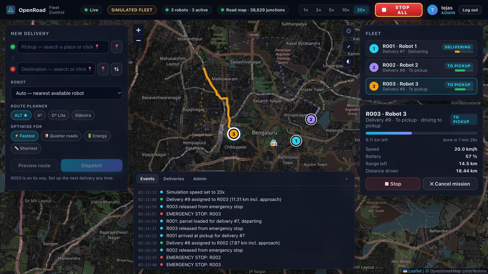

*Three robots running deliveries at the same time on the Bengaluru road network (OpenStreetMap), live over WebSocket.*

</div>

---

## 📸 Feature tour

> Screenshots from the running app. The robots are simulated — see [How the simulation works](#-how-the-simulation-works).

**Status bar** — live connection, the *SIMULATED FLEET* label, how many robots are busy, the loaded road map,
simulation speed (1×–20×) and **STOP ALL** for every robot.

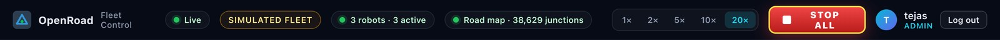

<table>
<tr>
<td width="50%" valign="top">

**📦 New delivery** — search or tap a pickup and a destination, let the fleet pick the nearest robot (or choose one),
then pick the planner (ALT, A\*, D\* Lite, Dijkstra) and what to optimise for.

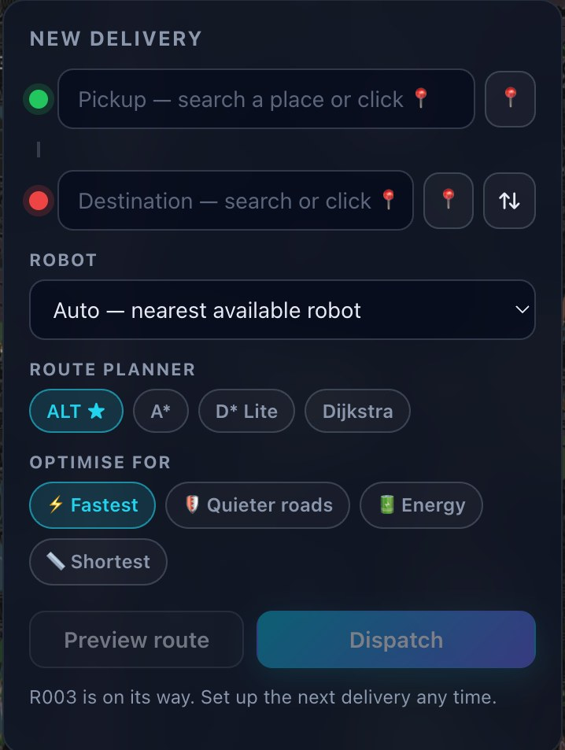

</td>
<td width="50%" valign="top">

**🤖 Several robots at once** — every free robot can take a delivery. Each row shows its job, its stage
(*to pickup → delivering*) and its battery.

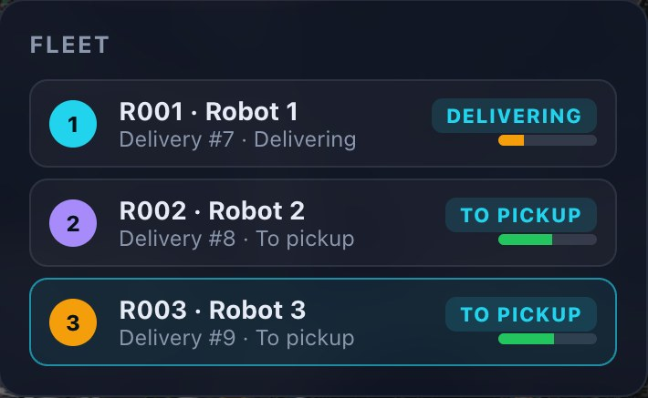

**🔋 Return to base & charging** — robots drive back to their base and charge there; idle robots wait for the next job.

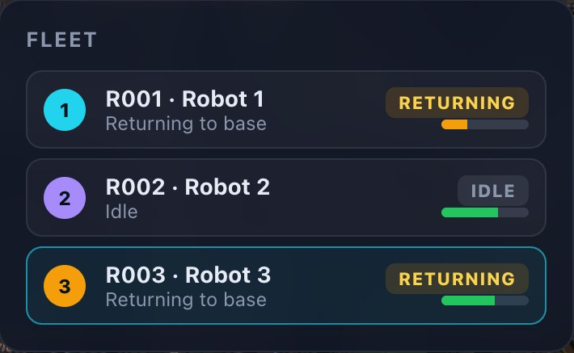

</td>
</tr>
<tr>
<td width="50%" valign="top">

**🚚 Picking up an order** — the selected robot's card: distance left, when the whole job will be done,
speed, battery, range and distance driven, with **Stop** and **Cancel mission**.

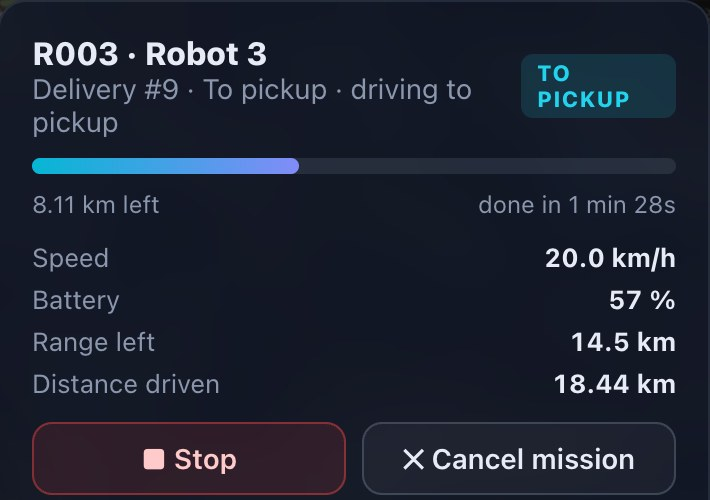

</td>
<td width="50%" valign="top">

**🏠 Heading home** — after a cancelled or finished job the robot plans a route back to its base.

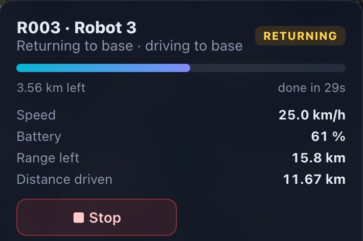

</td>
</tr>
<tr>
<td width="50%" valign="top">

**🗺️ Routes on real streets** — each robot draws the rest of its route in its own colour and it shrinks as the robot drives.

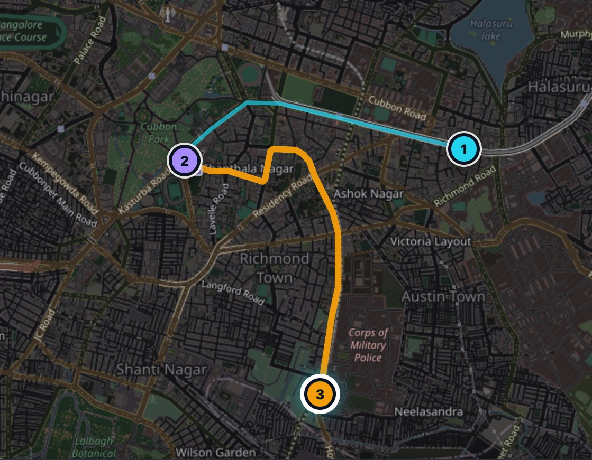

</td>
<td width="50%" valign="top">

**⭕ Operating area** — the dashed circle is the loaded road map; trips must start and end inside it,
so nothing is downloaded mid-trip.

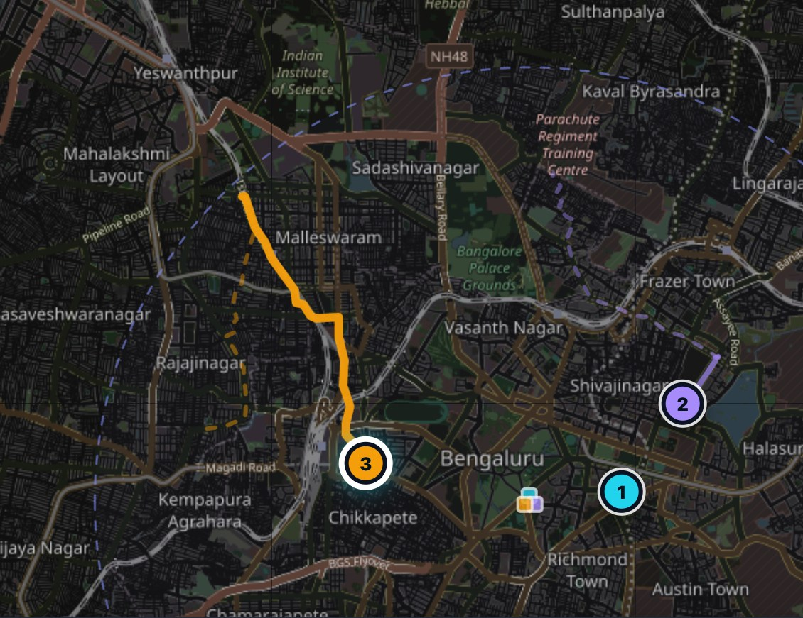

</td>
</tr>
</table>

**🧾 Event log** — every assignment, pickup, emergency stop and release, with timestamps:

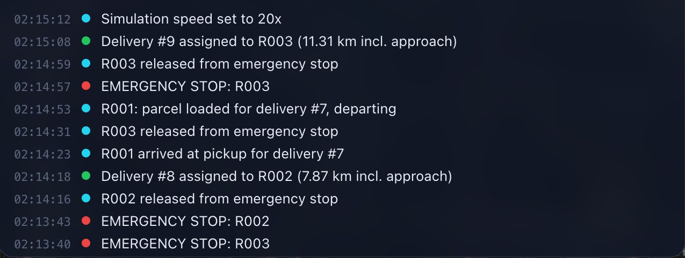

…and the end of the job: completed deliveries, a cancelled mission, robots returning and charging.

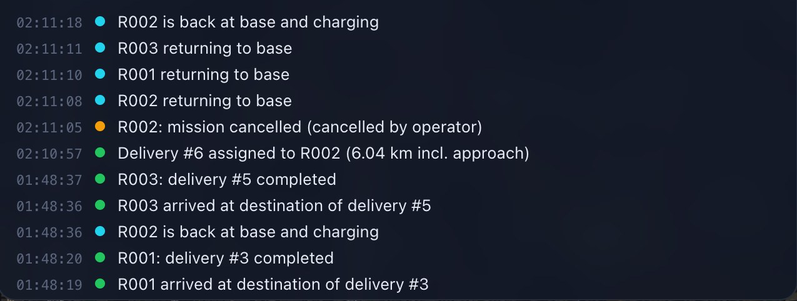

**Full view — robots heading home after their jobs:**

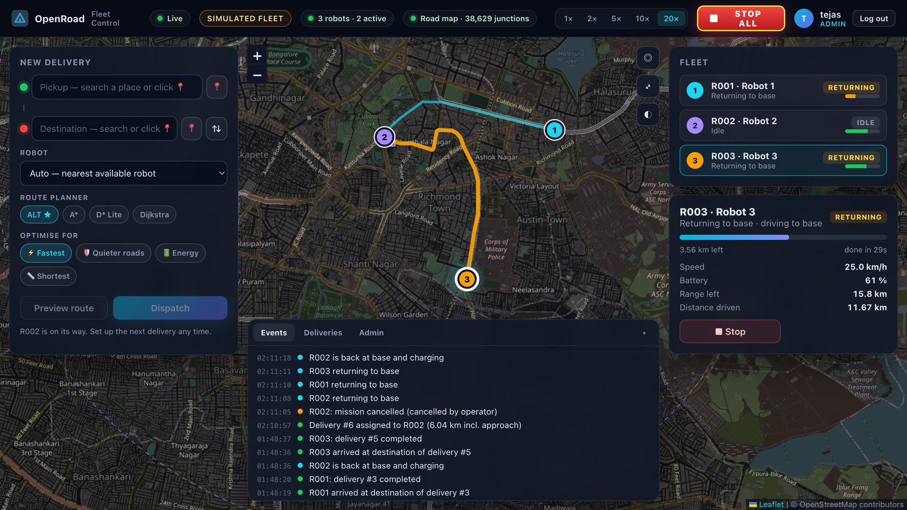

---

## ✨ Features

| Area | What it does |
|:-----|:-------------|
| **Route planning** | ALT (A\* + landmarks + triangle inequality), A\*, Dijkstra and D\* Lite on the OpenStreetMap road graph |
| **Route choice** | Best route plus alternatives (penalty method, overlap and stretch limits) |
| **Cost profiles** | fastest · shortest · energy-optimal · quieter roads |
| **Trajectory** | Real road geometry, curvature and a velocity profile (lateral / longitudinal acceleration limits) |
| **Fleet** | 3 robots by default, up to 20 (added in *Admin*); the robot that reaches the pickup first gets the job; deliveries run in parallel |
| **Missions** | robot → pickup → loading → destination → unloading; per-robot stop / release / cancel / return to base; STOP ALL |
| **Battery** | Energy per km (speed and grade dependent), range check before dispatch, automatic return and charging when low |
| **Map** | One road map for the operating area (dashed circle), cached on disk, works offline after the first download |
| **Security** | Login + roles, Argon2id, CSRF, rate limits, CSP, audit log — see [SECURITY.md](SECURITY.md) |

### 🔬 How the simulation works

No physical robot is connected. Each robot follows its planned route with the planned speed profile and a
battery model, and the dashboard labels the fleet **SIMULATED FLEET**. The dashboard shows only values the
simulation computes: position, speed, battery, range, distance and ETA.

---

## 🚀 Quick start

Needs **Python 3.11+** (Linux, macOS or Windows). **No API key is needed** — maps come from OpenStreetMap.

```bash
git clone https://github.com/Tejascodz/OpenRoad-Autonomy.git
cd OpenRoad-Autonomy

python3 -m venv venv
source venv/bin/activate            # Windows: venv\Scripts\activate
pip install -r requirements.txt

python scripts/setup_env.py         # creates .env with a random SECRET_KEY and asks for an admin password
python -m app.main                  # -> http://127.0.0.1:8000
```

On first start the app downloads the road map of the operating area in the background (or run
`python -m app.cli fetch-map` once to see progress). It is saved in `data/graphs/`, so later starts need no
internet. No internet at all? Set `OFFLINE_MAPS=true` in `.env` to use a synthetic demo road grid.

### Try it

1. Sign in, then set a pickup and a destination **inside the dashed circle** — search a place, click 📍 and
   tap the map, or paste `lat, lon`.
2. Leave *Robot* on **Auto** (the robot that reaches the pickup first is chosen) or pick one.
3. **Preview route** shows the route, alternatives and which robot will go → **Dispatch**.
4. Dispatch more deliveries — every free robot can run one at the same time. Click a robot to follow it,
   stop / release it, cancel its delivery or send it back to base.
5. Use **1×–20×** to speed up the simulation.

Sample places (all inside the default operating area, ≈ 5.7 km around 12.9716, 77.5946):

| Place | Latitude | Longitude |
|:------|:---------|:----------|
| Majestic | 12.9767 | 77.5713 |
| Indiranagar | 12.9719 | 77.6412 |
| Malleswaram | 13.0035 | 77.5700 |
| Lalbagh | 12.9507 | 77.5848 |
| MG Road | 12.9756 | 77.6066 |

### Troubleshooting

| Symptom | Fix |
|:--|:--|
| Map stays on **Downloading** | The public OpenStreetMap servers are busy. Stop the app and run `python -m app.cli fetch-map` (shows progress, retries a limited number of times, saves the map). **Use offline demo map** works meanwhile |
| **Map not available**, `python -m app.cli check-network` shows FAIL | The network blocks the map servers: try another network, or turn off VPN / ad-blocking DNS |
| *"That location is outside the loaded road map"* | Trips must start and end inside the dashed circle. For a bigger area: `python -m app.cli fetch-map --radius 10000` (metres), then restart |
| *"no robot is available right now"* | Every robot is busy, stopped or low on battery — wait, release stopped robots, or add robots in **Admin** |
| `pip` can't find a pinned version | Python is older than 3.11 — install a newer Python and recreate the venv |
| `CERTIFICATE_VERIFY_FAILED` | `pip install -U certifi`, or point `SSL_CERT_FILE` at your system CA bundle |
| Robot looks frozen | Use **5× / 10× / 20×** — at 1× it drives at a real 15 km/h |
| Forgot the admin password | `python -m app.cli reset-password --username <name>` |

### Users & roles

| Role | Can do |
|:-----|:-------|
| `viewer` | Watch the fleet live, see history, press **STOP** / **STOP ALL** |
| `operator` | + plan and dispatch deliveries, release / cancel / return robots, simulation speed, offline map switch |
| `admin` | + add / remove robots, manage users, audit log, system info |

```bash
python -m app.cli create-user --username alice --role operator   # password asked with hidden input
python -m app.cli reset-password --username alice
python -m app.cli unlock --username alice
python -m app.cli list-users
```

---

## 🧭 Path planning

```
 request ─► operating-area / trip checks ─► OSM road graph (cached) ─► cost profile
         ─► ALT / A* / Dijkstra / D* Lite ─► alternatives (penalty method)
         ─► dense trajectory on real road geometry ─► curvature ─► velocity profile
 dispatch: every free robot plans robot → pickup; the first to arrive (with enough battery) gets the job
 fleet loop (10 Hz): each robot follows its trajectory's speed profile ─► battery ─► events / status
```

| Component | File | Notes |
|:----------|:-----|:------|
| Cost profiles | `app/services/planning/costs.py` | admissible lower bound per profile, so heuristics stay optimal |
| Dijkstra / A\* / **ALT** | `app/services/planning/search.py` | ALT: 8 farthest-point landmarks, 1.3–3× fewer node expansions than A\* in the tests |
| **D\* Lite** | `app/services/planning/dstar_lite.py` | Koenig & Likhachev 2002; incremental repair verified against Dijkstra |
| Alternatives | `app/services/planning/planner.py` | ≤ 1.35× best cost, ≤ 60 % overlap |
| Trajectory + speed profile | `app/services/planning/trajectory.py` | a_lat ≤ 1.5 m/s², accel 1.0, decel 2.0, U-turn detection |
| Fleet + dispatch | `app/services/fleet.py` | assignment by ETA, mission legs, battery reserve, return + charging |

Optimality is covered by tests (`tests/test_planning.py`) that compare every algorithm with NetworkX Dijkstra on
randomised graphs, including repeated D\* Lite repairs.

---

## 🛡️ Security

Login and roles on every route and the WebSocket · Argon2id passwords with lockout · CSRF tokens and Origin
checks · strict CORS allow-list · rate limits · CSP and security headers · input validation · audit log ·
hardened Docker setup. Details: [SECURITY.md](SECURITY.md).

Every push runs tests, `bandit`, `pip-audit` and a `gitleaks` scan of the full history:

```bash
pip install -r requirements-dev.txt
pytest
bandit -r app scripts
pip-audit -r requirements.txt
```

---

## 📁 Project structure

```
OpenRoad-Autonomy/
├── app/
│   ├── main.py                    # app factory, middleware, startup
│   ├── config.py                  # validated settings (env / .env)
│   ├── cli.py                     # users, check-network, fetch-map
│   ├── state.py                   # fleet + websocket singletons
│   ├── api/                       # routes (planning, dispatch, fleet, map), auth, admin, websocket
│   ├── security/                  # passwords, tokens, RBAC/CSRF, rate limit, middleware
│   ├── models/                    # SQLAlchemy models (delivery, robot, user, audit)
│   ├── services/
│   │   ├── planning/              # geo, graph, costs, search (ALT), dstar_lite, trajectory, planner
│   │   ├── fleet.py               # robots, dispatch, missions, simulation loop
│   │   ├── battery_model.py
│   │   ├── map_service.py         # OSM road map (cached on disk) / offline grid
│   │   ├── overpass_client.py     # bounded OpenStreetMap download client
│   │   ├── geocode.py             # place search (Nominatim)
│   │   └── database_service.py
│   └── static/                    # dashboard (self-hosted Leaflet, CSP-safe JS)
├── docs/screenshots/
├── scripts/setup_env.py           # creates .env with random secrets + first admin
├── tests/
├── .env.example                   # template only — the real .env is git-ignored
├── Dockerfile · docker-compose.yml · nginx.conf
└── requirements*.txt
```

---

## 📡 API reference

All `/api/v1` routes need a session cookie (browser) or `Authorization: Bearer <token>` (scripts).
Cookie-authenticated `POST` / `PATCH` / `DELETE` also need the `X-CSRF-Token` header.

| Method | Endpoint | Role | Description |
|:------:|:---------|:----:|:------------|
| POST | `/api/v1/auth/login` | – | JSON login, sets session cookie |
| POST | `/api/v1/auth/token` | – | OAuth2 password form → bearer token |
| POST | `/api/v1/auth/logout` · `/logout-all` | any | end session(s) |
| GET | `/api/v1/auth/me` | any | current user + CSRF token |
| POST | `/api/v1/auth/change-password` | any | rotates sessions |
| POST | `/api/v1/plan` | operator | route preview + alternatives + which robot would go |
| POST | `/api/v1/start_delivery` | operator | plan + assign a robot (`robot_id` optional) |
| GET | `/api/v1/fleet` · `/robots/{id}/route` | viewer | all robots / one robot's remaining route |
| POST | `/api/v1/robots/{id}/stop` · `/fleet/stop_all` | viewer | emergency stop (one / all) |
| POST | `/api/v1/robots/{id}/resume` · `/cancel` · `/return` · `/fleet/resume_all` · `/fleet/sim_speed` | operator | fleet control |
| GET | `/api/v1/deliveries/active` · `/history` · `/{id}` | viewer | records |
| GET | `/api/v1/map/status` | viewer | map state + operating area |
| GET/POST/DELETE | `/api/v1/admin/robots…` | admin | add / remove robots |
| GET/POST/PATCH/DELETE | `/api/v1/admin/users…` · `/admin/audit` | admin | user management |
| WS | `/api/v1/ws/fleet` | viewer | 1 Hz fleet feed (same-origin, cookie auth) |

```bash
TOKEN=$(curl -s -X POST localhost:8000/api/v1/auth/token -d "username=alice&password=$PW" | jq -r .access_token)
curl -s -H "Authorization: Bearer $TOKEN" localhost:8000/api/v1/fleet
```

Interactive docs at `/docs` in development only (disabled when `ENVIRONMENT=production`).

---

## 🐳 Docker deployment

```bash
python scripts/setup_env.py            # random SECRET_KEY + POSTGRES_PASSWORD; set ENVIRONMENT=production
# set TRUSTED_HOSTS=your.domain in .env
mkdir ssl && cp fullchain.pem privkey.pem ssl/
docker compose up -d --build
docker compose exec robot-api python -m app.cli create-user --username admin --role admin
```

Only nginx (80 → 443) is published. The API runs as a non-root user on a read-only filesystem; Postgres is
reachable only on the internal network.

---

## 🔧 Connecting real robots

The simulation is isolated in `Fleet._drive()` (`app/services/fleet.py`). To connect real robots, replace it
with each robot's reported position, speed and battery; dispatch, missions, events, the API and the dashboard
stay the same. Real robots also need their own on-board safety system (obstacle detection, braking) — this
project does not provide one.

---

## 🤝 Contributing

1. Fork → 2. `git checkout -b feature/amazing` → 3. `pytest && bandit -r app` → 4. open a pull request.
Never commit `.env`, keys or databases (they are git-ignored, and the pre-commit hook scans for secrets).

## 📜 License

**MIT** — see [LICENSE](LICENSE). Third-party components: [THIRD_PARTY_NOTICES.md](THIRD_PARTY_NOTICES.md).

<div align="center">

**Tejas** · [@Tejascodz](https://github.com/Tejascodz) · [Report a bug](https://github.com/Tejascodz/OpenRoad-Autonomy/issues)
· Security issues: please report privately ([SECURITY.md](SECURITY.md))

[OpenStreetMap](https://www.openstreetmap.org/) · [OSMnx](https://osmnx.readthedocs.io/) · [FastAPI](https://fastapi.tiangolo.com/) · [Leaflet](https://leafletjs.com/)

</div>
